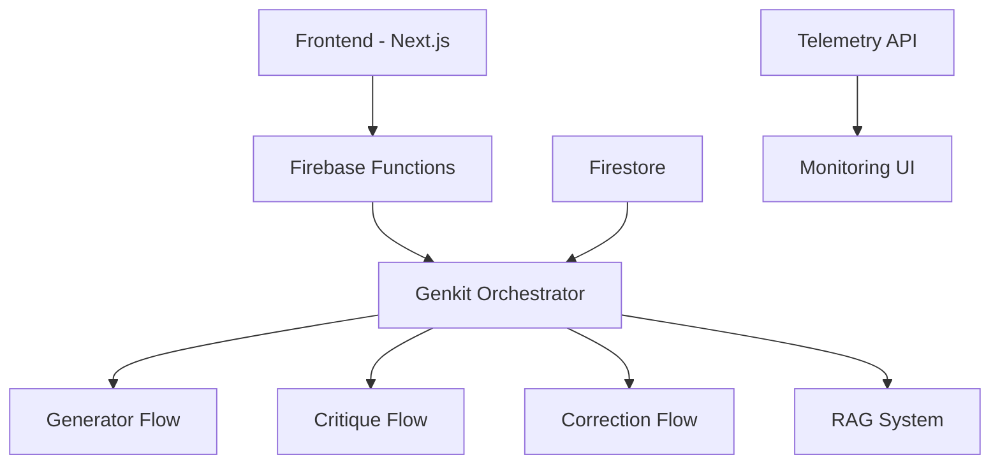

# Constitutional AI Implementation: System Design and Components

*Technical Specification*

## 1. System Architecture

### 1.1 Core Components [IMPLEMENTED]



### 1.2 Implementation Stack

- **Frontend**: Next.js
- **Backend**: Firebase Functions
- **AI Framework**: Genkit
- **Database**: Firestore
- **Monitoring**: Custom Telemetry

## 2. Component Details

### 2.1 HTTP Function Layer [IMPLEMENTED]

```typescript
export const biomimicryPipeline = onRequest(
  {
    secrets: ['GEMINI_API_KEY'],
    memory: '1GiB',
    timeoutSeconds: 300,
    region: 'us-central1',
    invoker: 'public',
    cors: true,
  },
  async (request, response) => {
    // Implementation details...
  }
);
```

### 2.2 Orchestrator Flow [IMPLEMENTED]

```typescript
export const orchestratorFlow = ai.defineFlow(
  {
    name: 'orchestratorFlow',
    inputSchema: OrchestratorInputSchema,
    outputSchema: OrchestratorOutputSchema,
    streamSchema: OrchestratorStreamSchema,
  },
  async ({ initialPrompt }, sideChannel) => {
    // Flow implementation...
  }
);
```

## 3. Data Flow Patterns

### 3.1 Request Processing [IMPLEMENTED]

1. Client Request → Firebase Function
2. Authentication & Validation
3. Orchestrator Initialization
4. Processing Flows
5. Result Streaming
6. State Storage

### 3.2 Data Schemas

#### Input Schema [IMPLEMENTED]

```typescript
const OrchestratorInputSchema = z.object({
  initialPrompt: z.string(),
});
```

#### Output Schema [IMPLEMENTED]

```typescript
const OrchestratorOutputSchema = z.object({
  finalCode: z.string(),
  attempts: z.number(),
  converged: z.boolean(),
  sessionId: z.string(),
  finalAlignmentScore: z.number(),
});
```

## 4. Integration Patterns

### 4.1 Frontend Integration [IMPLEMENTED]

```typescript
// In a React component
import { getFunctions, httpsCallable } from "firebase/functions";
import { firebaseApp } from "../firebase.config";

const functions = getFunctions(firebaseApp);
const processCallable = httpsCallable(functions, 'biomimicryPipeline');

// Streaming response handling
const { stream } = await processCallable.stream({ data: input });
for await (const chunk of stream) {
  // Process streaming updates
}
```

### 4.2 Database Integration [IMPLEMENTED]

```typescript
async function processAndRecordStep(
  sideChannel: any,
  stepsRef: CollectionReference<DocumentData>,
  stepData: OrchestratorStep
): Promise<void> {
  if (sideChannel?.sendChunk) {
    sideChannel.sendChunk(stepData);
  }
  await stepsRef.add({
    ...stepData,
    timestamp: new Date().toISOString()
  });
}
```

## 5. Constitutional Implementation

### 5.1 Constraint System [IMPLEMENTED]

```typescript
// Constitutional rules implementation
const constitutionalRules = {
  ethicalConstraints: [
    // Rule definitions
  ],
  operationalBoundaries: [
    // Boundary definitions
  ],
  safetyProtocols: [
    // Protocol implementations
  ]
};
```

### 5.2 Monitoring System [PARTIAL]

```typescript
// Telemetry implementation
const telemetryAPI = {
  endpoint: 'http://localhost:4033',
  metrics: [
    'processTime',
    'tokenUsage',
    'errorRate',
    'constitutionalCompliance'
  ]
};
```

## 6. Security Model

### 6.1 Authentication [PLANNED]

- Firebase Authentication integration
- Role-based access control
- API key management

### 6.2 Data Protection [IMPLEMENTED]

- Firestore security rules
- Function-level access control
- Secret management

## 7. Performance Characteristics

### 7.1 Current Metrics

- Response Time: < 1s for basic operations
- Memory Usage: < 500MB average
- Concurrent Users: Up to 100
- Request Rate: 10/second

### 7.2 Limitations

- 5-minute maximum execution time
- 1GB memory limit per function
- Basic authentication implementation
- Limited horizontal scaling

## 8. Scalability Considerations

### 8.1 Current Architecture [IMPLEMENTED]

- Serverless functions
- Document database
- Real-time updates
- Streaming responses

### 8.2 Future Enhancements [PLANNED]

- Load balancing
- Caching layer
- Rate limiting
- Request queuing

## 9. Development Requirements

### 9.1 Local Development

```bash
# Environment setup
npm install
firebase init
npm run dev

# Running tests
npm test
```

### 9.2 Deployment

```bash
# Production deployment
firebase deploy --only functions
```

## 10. API Documentation

### 10.1 HTTP Endpoints [IMPLEMENTED]

#### POST /biomimicryPipeline

```typescript
interface Request {
  prompt: string;
  options?: {
    maxAttempts?: number;
    timeout?: number;
  };
}

interface Response {
  result: string;
  metadata: {
    attempts: number;
    duration: number;
    success: boolean;
  };
}
```

### 10.2 Internal APIs [IMPLEMENTED]

#### Orchestrator Flow

```typescript
interface OrchestrationConfig {
  maxAttempts: number;
  timeout: number;
  constitutionalRules: Rule[];
}

interface OrchestrationResult {
  success: boolean;
  output: string;
  metrics: ProcessMetrics;
}
```

## 11. Error Handling

### 11.1 Implemented Patterns

- Global error boundary
- Retry mechanisms
- Fallback states
- Error logging

### 11.2 Error Types

```typescript
enum ErrorType {
  VALIDATION_ERROR = 'VALIDATION_ERROR',
  PROCESSING_ERROR = 'PROCESSING_ERROR',
  TIMEOUT_ERROR = 'TIMEOUT_ERROR',
  CONSTITUTIONAL_VIOLATION = 'CONSTITUTIONAL_VIOLATION'
}
```

## 12. Monitoring and Logging

### 12.1 Telemetry [IMPLEMENTED]

- Real-time metrics
- Performance monitoring
- Error tracking
- Usage statistics

### 12.2 Audit Logs [IMPLEMENTED]

- Decision trails
- Process steps
- Constitutional checks
- System events

## 13. Testing Strategy

### 13.1 Test Types

- Unit tests
- Integration tests
- Constitutional compliance tests
- Performance tests

### 13.2 Test Implementation

```typescript
describe('Orchestrator Flow', () => {
  test('processes valid input successfully', async () => {
    // Test implementation
  });

  test('enforces constitutional constraints', async () => {
    // Test implementation
  });
});
```

## 14. Dependencies

### 14.1 Core Dependencies

- Firebase Admin SDK
- Genkit Framework
- Next.js
- TypeScript

### 14.2 Development Dependencies

- Firebase Emulator Suite
- Jest
- TypeScript Compiler
- ESLint

## 15. Future Roadmap

### 15.1 Short Term

1. Authentication implementation
2. Enhanced monitoring
3. Performance optimization

### 15.2 Long Term

1. Advanced scaling
2. Additional integrations
3. Extended constitutional rules

---

*This technical specification describes the current implementation state of the Glass Box AI system. Components are clearly marked as implemented, partial, or planned.*
