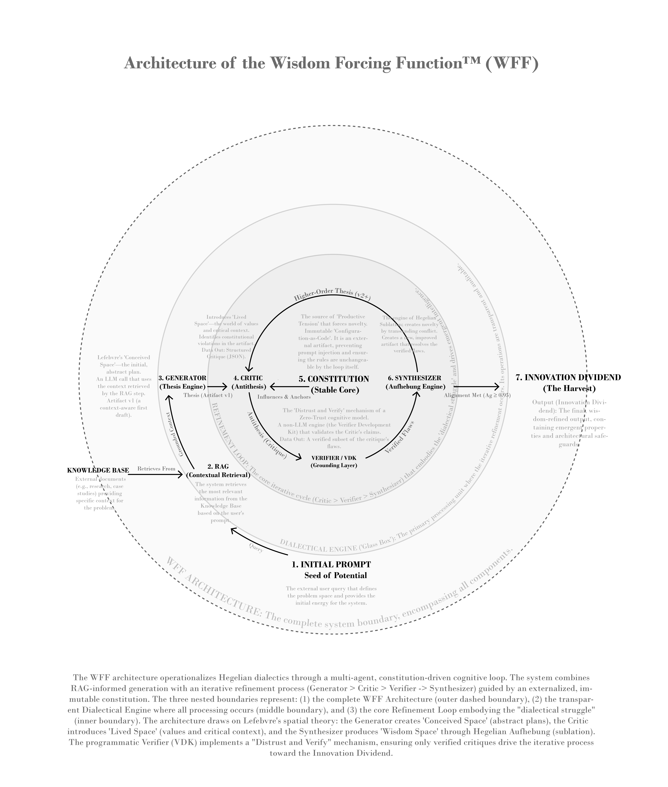

# The Wisdom Forcing Function

### What if AI alignment could invent solutions, not just prevent harm?

> **Core Thesis:** The "alignment tax" is an artifact of limited design. When alignment is architected as productive tension rather than restrictive rules, it becomes an engine for innovation—yielding an **"innovation dividend"** of novel, resilient solutions.

---

Current AI alignment treats safety as  **constraint optimization** : preventing harm by restricting capability. This approach:

* Mitigates known risks effectively
* Cannot generate novel solutions to complex systemic problems
* Positions alignment as a cost center, reducing utility
* Lacks the wisdom needed for navigating unprecedented challenges

**We asked:** What if alignment could be designed not just to constrain, but to  *cultivate* ?

---

## The Solution: Dialectical Architecture

The **Wisdom Forcing Function (WFF)** reframes alignment as an ecological relationship—from *fencing a beast* to  *gardening an ecosystem* .

By operationalizing **productive tension** through a multi-agent dialectical loop, the system:

* Generates solutions through structured cognitive conflict (thesis → antithesis → synthesis)
* Self-corrects via iterative "dialectical struggle" with programmatic verification
* Produces fully auditable reasoning traces ("Glass Box" transparency)
* Enables communities to co-design their own AI constitutions

### Architecture Overview

<pre class="overflow-visible!" data-start="2080" data-end="2453">

<code class="whitespace-pre!">1. Constitution → Tension-rich principles guide all reasoning
2. Generator → Proposes solution (Thesis)
3. Critic → Identifies flaws (Antithesis)
4. Verifier (VDK) → Programmatically validates critique
5. Synthesizer → Creates higher-order solution (Synthesis)
6. Iterate → Until constitutional alignment achieved
7. Audit Trail → Every step logged for transparency
</code>

</pre>

**Key Innovation:** The **Verifier Development Kit (VDK)** ensures critiques are grounded in logic, creating a "Zero-Trust Cognitive Loop".

---

## Innovation Dividend

### Novel Governance Architectures

| Architecture                                | Description                                                                                          | Novelty |
| ------------------------------------------- | ---------------------------------------------------------------------------------------------------- | ------- |
| **Unbypassable Gates**                | Constitutional validation in code constructors — systems*cannot instantiate*in compromised states | 4/5     |
| **Dead Man's Switch Accountability**  | Self-enforcing transparency protocols with autonomous dissemination triggers                         | 5/5     |
| **Living Treaties**                   | Adaptive agreements with ecological ratchet principles—strengthen but never weaken protections      | 5/5     |
| **Anti-Capture Democratic Protocols** | Nested verification loops preventing elite capture                                                   | 5/5     |
| **Liberatory Intervention**           | Meta-ethical principle resolving paradoxes in the system's own constitution                          | 5/5     |

*See [WFF Paper](https://github.com/CarlosArleo/regenerative-ai-architecture/blob/main/docs/WFF_Paper.pdf) for detailed assessments.*

---

## Experiments & Case Studies

## [Constitutional AI: Key Findings from N=36 Experimental Study](https://github.com/CarlosArleo/regenerative-ai-architecture/tree/main/docs/assets/Constitutional%20AI)

**Verified Dialectical Kernel (VDK) - Temperature Robustness Analysis**

## [Regenerative Development AI: A Constitutional Framework for Community Sovereignty](https://github.com/CarlosArleo/regenerative-development-ai)

###### Complete Project Vision & Theoretical Foundations

Where Regenerative Frameworks Meet Constitutional AI: A Research Project in Epistemic Innovation

## **[From Community Wisdom to a Living Constitution](https://github.com/CarlosArleo/regenerative-development-ai/tree/main/case-studies/carrington-moss)**

A Proposal for the Future of Carrington Moss

## [Architecting DAO 3.0](https://carlosarleo.github.io/dao3-blueprint/#section-1-the-starting-point---our-shared-struggle)

A Battle-Tested Blueprint for Solving ReFi&#39;s Implementation Gap

### Key Experiments

* **[The Genesis Protocol](https://github.com/CarlosArleo/regenerative-ai-architecture/tree/main/docs/case-studies/experiments/The%20Genesis%20Protocol)**

  Radical introspection and methodology for governance co-design.
* **[The Interrogation Protocol](https://github.com/CarlosArleo/regenerative-ai-architecture/tree/main/docs/case-studies/experiments/The%20Interrogation%20Protocol)**

  10-iteration dialectical struggle to architect accountability.
* **[The Tale of Three AIs](https://github.com/CarlosArleo/regenerative-ai-architecture/tree/main/docs/case-studies/experiments/The%20Tale%20of%20Three%20AIs)**

  Comparative validation of Constitutional vs. full WFF models.
* **[All Experiments](https://github.com/CarlosArleo/regenerative-ai-architecture/tree/main/docs/case-studies/)**

  Complete archive of case studies.

### Example Files

[Genesis Protocol Analysis](``https://github.com/CarlosArleo/regenerative-ai-architecture/blob/main/docs/case-studies/experiments/The%20Genesis%20Protocol/analysis.md``)
[Tale of Three AIs Main Analysis](``https://github.com/CarlosArleo/regenerative-ai-architecture/blob/main/docs/case-studies/experiments/The%20Tale%20of%20Three%20AIs/01_ANALYSIS_The_Tale_of_Three_AIs.md``)

---

## Theoretical Foundations

### Dialectical Systems (Henri Lefebvre)

* Social space emerges from tension between conceived (plans), perceived (practices), and lived (values).
* Operationalized: Generator ↔ Critic → Synthesizer (wisdom space).

### Regenerative Design (Bill Reed, Janine Benyus)

* Beyond sustainability, regeneration cultivates potential.
* Patterns: distributed agency, productive tension, verification loops, meta-governance.

### Critical Theory (Habermas, Foucault)

* Power-aware design to resist elite capture.
* Transparent processes and externalized constitutions prevent manipulation.

---

## Documentation & Resources

### Core Documentation

* **[Full Paper](https://github.com/CarlosArleo/regenerative-ai-architecture/blob/main/docs/WFF_Paper.md)**
* **[Project Overview](https://github.com/CarlosArleo/regenerative-ai-architecture/blob/main/docs/01-project-overview.md)**
* **[Constitutional Philosophy](https://github.com/CarlosArleo/regenerative-ai-architecture/blob/main/docs/02-constitution-philosophy.md)**
* **[Architecture Deep Dive](https://github.com/CarlosArleo/regenerative-ai-architecture/blob/main/docs/03-architecture.md)**

### Assets

* **[Architecture PNG](https://github.com/CarlosArleo/regenerative-ai-architecture/blob/main/docs/assets/wff-architecture.png)**
* **[Architecture PDF](https://github.com/CarlosArleo/regenerative-ai-architecture/blob/main/docs/assets/wff_architecture_diagram.pdf)**
* [Knowledge Base](https://github.com/CarlosArleo/regenerative-ai-architecture/tree/main/docs/assets/Constitutional%20AI/knowledge%20base)
* [Constitutional AI](https://github.com/CarlosArleo/regenerative-ai-architecture/tree/main/docs/assets/Constitutional%20AI)

---

## How to Get Involved

### Research Partners

* AI Safety & Alignment Researchers
* Critical AI Scholars

### Practitioners

* Participatory Governance Experts
* Regenerative Design Practitioners

### Technical Collaborators

* ML Engineers
* Verification & Formal Methods Specialists

### Quick Start

1. Read the [WFF Paper](https://github.com/CarlosArleo/regenerative-ai-architecture/blob/main/docs/WFF_Paper.pdf) [https://zenodo.org/records/17279105](https://zenodo.org/records/17279105) or [Project Overview](https://github.com/CarlosArleo/regenerative-ai-architecture/blob/main/docs/01-project-overview.md)
2. Explore [Case Studies](https://github.com/CarlosArleo/regenerative-ai-architecture/tree/main/docs/case-studies)
3. Choose your path: research, practice, or technical development
4. Open issues, suggest experiments, or pilot protocols
5. Watch the [video resources](https://drive.google.com/drive/folders/1DQa8QjJB3blLUlEIIvYysh8d6ntiDs9X?usp=drive_link)

### Contact

**Principal Investigator:** Carlos Arleo

**Email:** [c.arleo@localis-ai.uk]()

**Institution:** The Regenerative Development Initiative

---

## Citation

<pre class="overflow-visible!" data-start="7815" data-end="8173">

<code class="whitespace-pre! language-bibtex">@misc{arleo2025wff,
  author = {Arleo, Carlos},
  title = {From Urban Ecology to AI Alignment: The Wisdom Forcing Function as an Innovation Dividend},
  year = {2025},
  institution = {The Regenerative Development Initiative},
  howpublished = {\url{https://github.com/CarlosArleo/regenerative-ai-architecture}},
  note = {Research prototype}
}
</code>

</pre>

---

## License

Released under the MIT License — see [LICENSE.md](LICENSE.md)

---

## Acknowledgments

* Anthropic's Constitutional AI team
* Henri Lefebvre (spatial dialectics)
* Bill Reed & Janine Benyus (regenerative design & biomimicry)
* Broader AI safety, participatory governance, and regenerative design communities

---

  <strong>The alignment "tax" is an artifact of a limited paradigm.</strong> 
  When we design for co-evolution, constraints don't limit—they liberate.

---
