# Constitutional AI Framework - Minimalist Diagrams

## Diagram 1: Dialectical Forcing Function (Core Mechanism)

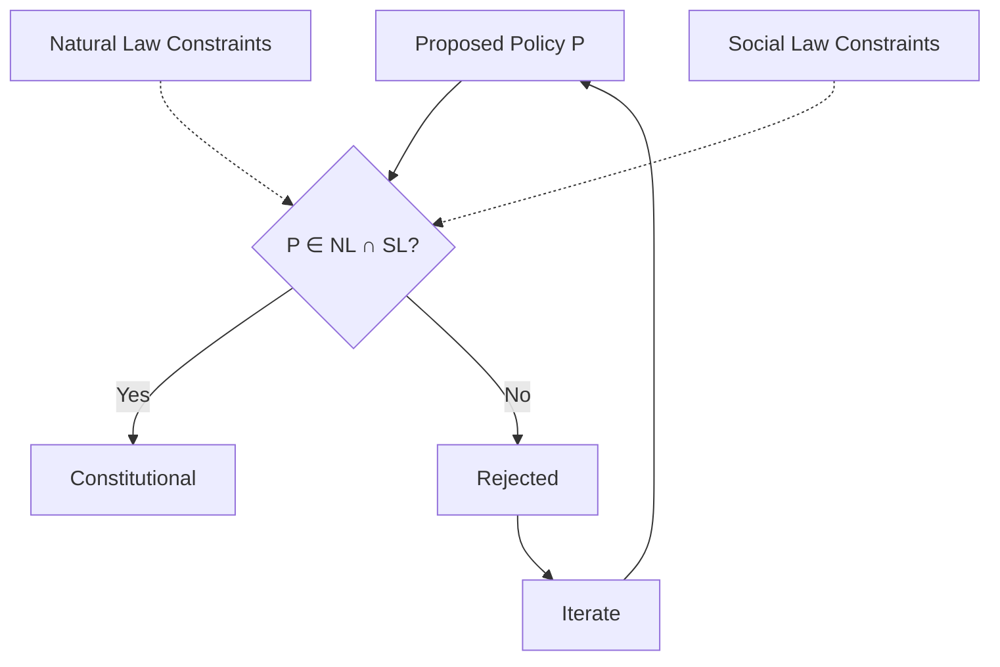

---

## Diagram 2: Domain Constraint Architecture

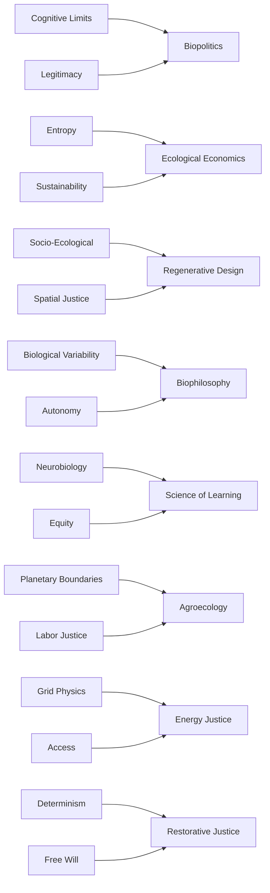

---

## Diagram 3: Three Fundamental Dialectical Tensions

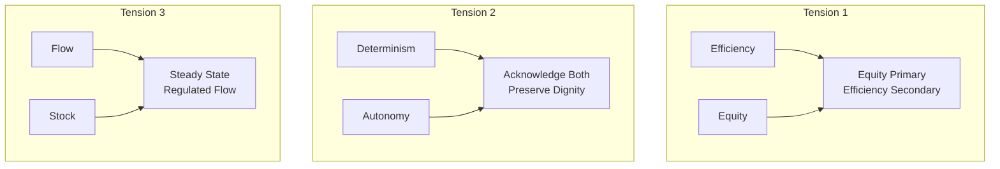

---

## Diagram 4: Optimization Failure Modes

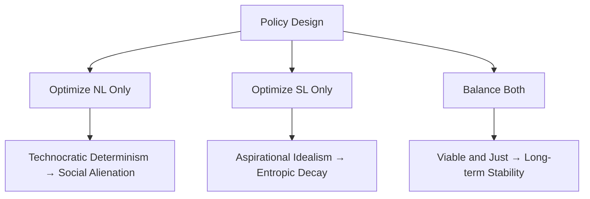

---

## Diagram 5: Domain Maturity & Implementation Readiness

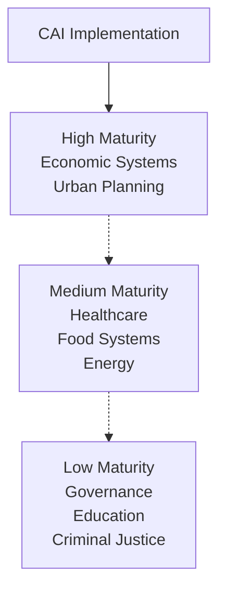

---

## Diagram 6: Meta-Constitutional Principles

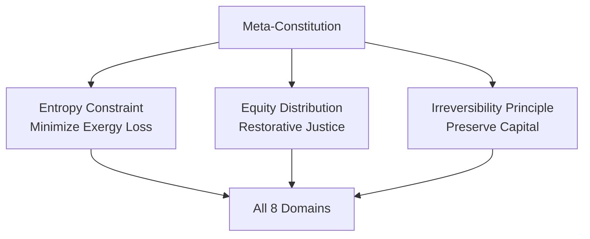

---

## Diagram 7: Material Basis of Social Justice

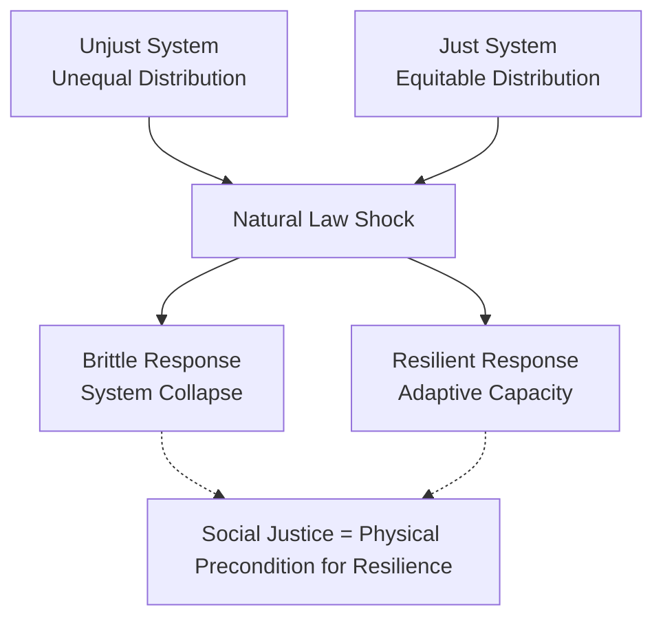

---

## Diagram 8: Implementation Risks & Safeguards

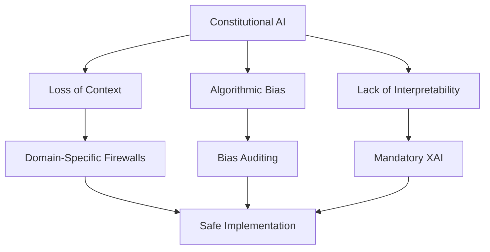

---

## Diagram 9: Complete System Architecture

```mermaid
graph TB
    INPUT[Policy Input]
  
    NL_LAYER[NL Constraint Layer<br/>Thermodynamics | Ecology | Biology]
    SL_LAYER[SL Constraint Layer<br/>Justice | Legitimacy | Equity]
  
    DFF[Dialectical Forcing Function]
  
    VIABLE[Viable Space]
    JUST[Just Space]
  
    INTERSECTION[NL ∩ SL]
  
    OUTPUT_PASS[Policy Approved]
    OUTPUT_FAIL[Policy Rejected]
  
    INPUT --> NL_LAYER
    INPUT --> SL_LAYER
  
    NL_LAYER --> VIABLE
    SL_LAYER --> JUST
  
    VIABLE --> DFF
    JUST --> DFF
  
    DFF --> INTERSECTION
  
    INTERSECTION -->|Pass| OUTPUT_PASS
    INTERSECTION -->|Fail| OUTPUT_FAIL
    OUTPUT_FAIL -.-> INPUT
```

---

## Diagram 10: Eight Domains Flow

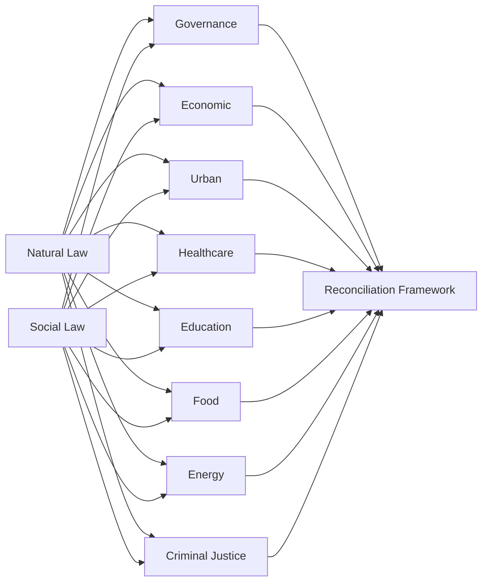

---

## Diagram 11: Constraint Hierarchy

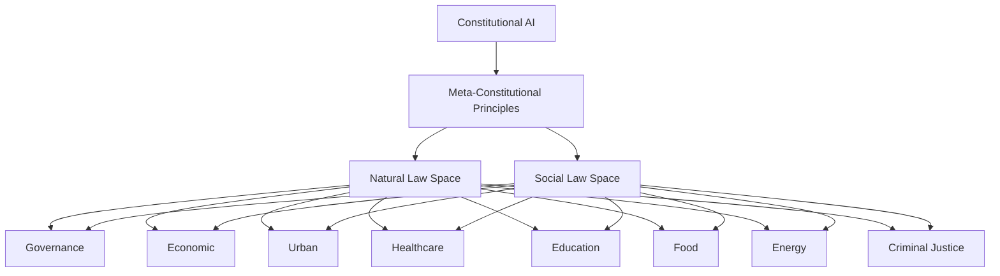

---

## Diagram 12: Policy Evaluation Process (Simplified)

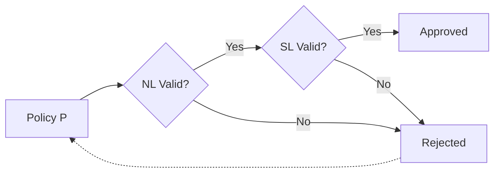

---

## Usage Instructions

These minimalist diagrams use:

- Simple lines and arrows only
- No color coding
- No background fills
- No boxes or borders
- Plain text labels
- Clear hierarchies

They'll render cleanly in any Mermaid viewer with a minimal aesthetic.
